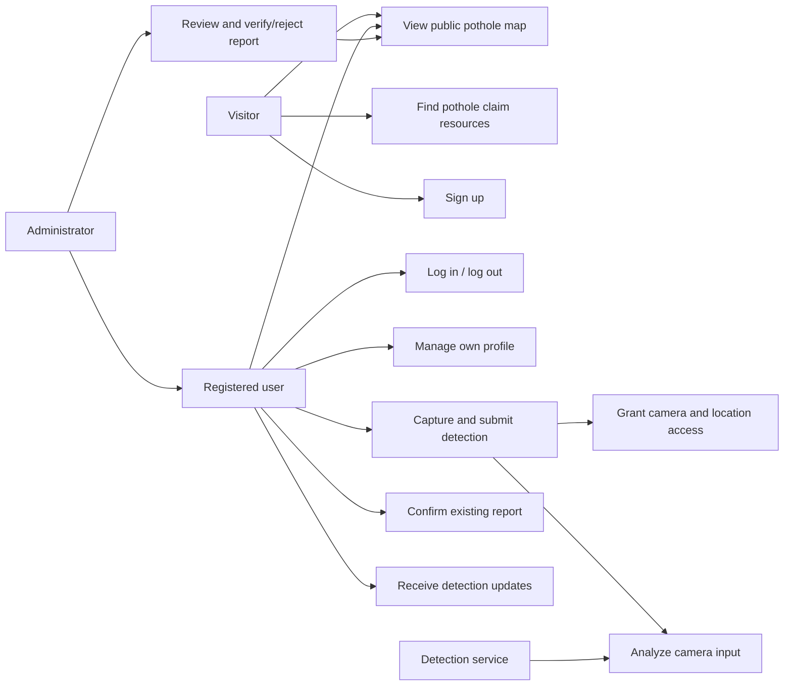
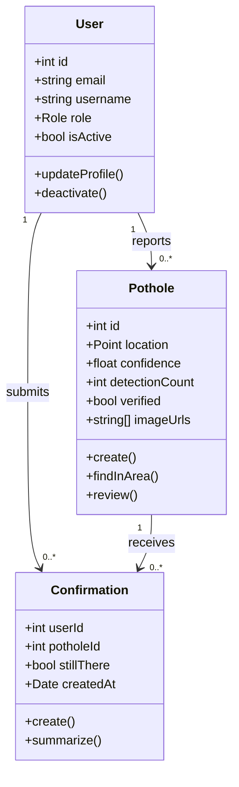
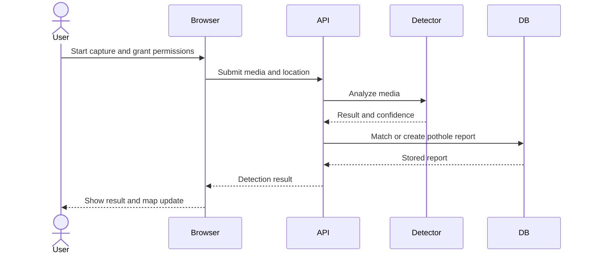
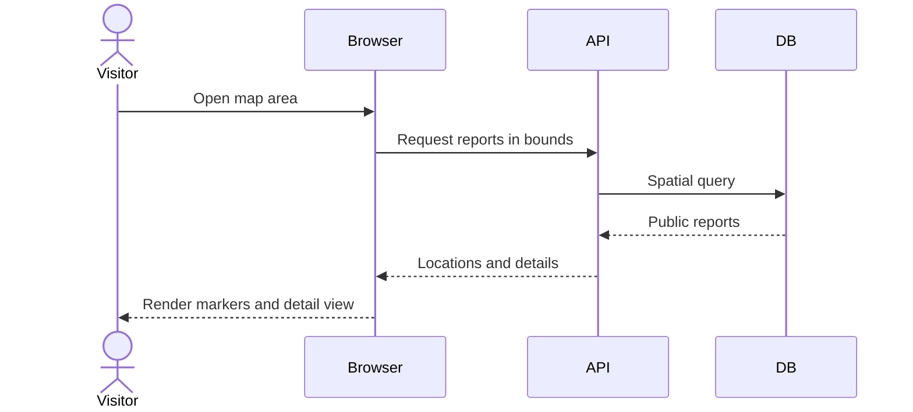
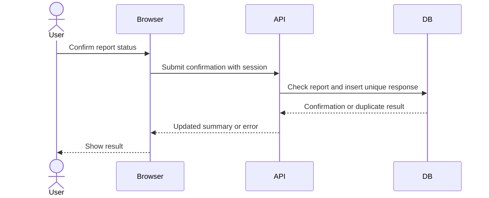

# Software Requirements and Design Report

**Project:** Open Pothole Tracker

**Repository inspected:** 2026-10-05

**Project team:** Linh Nguyen, Thien Le, Vinh Do, Hoang Vu, Quang Minh Nguyen

> Requirements and acceptance criteria below are a **draft specification**. “Implemented” means visible in this repository; it does not mean runtime verified.

## 1. Overview and scope

Open Pothole Tracker is intended to let people detect potholes from device camera input, associate detections with GPS coordinates, view reports on a shared interactive map, receive timely updates, confirm whether a pothole remains, and let administrators review reports. Visitors should also be able to find pothole claim resources. The target is a mobile-friendly web application. The current increment has account/profile API code and a geospatial schema; the detection, map, confirmation, and review workflows remain to be built.

**Actors:** visitor (no account), registered user, administrator, and the external detection service/model. Administrators also have registered-user capabilities. “Report” below means a stored pothole record; “detection” means a camera-analysis result that may create or update a report.

## 2. Functional requirements

Each requirement describes a user-visible capability at a high level. The lead and supporting modules identify where the work belongs; several flows require integration across team members. Priorities describe proposed scope, while the last column reports only what is visible in this repository.

| ID | Priority | Functional requirement | Lead module / member | Supporting module(s) | Repository status |
| --- | --- | --- | --- | --- | --- |
| FR-01 | High | Users shall be able to create accounts, sign in and out, and manage their profiles. | Authentication and accounts — Hoang Vu | Backend API — Linh Nguyen | Account/profile API and selected pages exist; frontend setup is incomplete. |
| FR-02 | High | Visitors and users shall be able to explore an interactive map and view pothole details by location. | Frontend and map — Thien Le | Geospatial — Vinh Do; backend API — Linh Nguyen | Spatial schema exists; map UI and report endpoints are absent. |
| FR-03 | Low | Visitors shall be able to find insurance and transportation-agency resources for pothole claims. | Public frontend — Thien Le | — | No claim-resource page is present. |
| FR-04 | High | Users shall be able to capture road footage with their device camera and share their location for detection. | Camera, GPS, and geospatial — Vinh Do | Frontend — Thien Le | Camera and location workflow is absent. |
| FR-05 | High | The system shall analyze submitted camera data for potholes and return detection results. | AI detection — Quang Minh Nguyen | Camera/GPS — Vinh Do; backend API — Linh Nguyen | Detection router is empty; no model integration is present. |
| FR-06 | High | The system shall store and retrieve pothole reports with their location, detection information, and images. | Backend, database, and APIs — Linh Nguyen | AI detection — Quang Minh Nguyen; geospatial — Vinh Do | PostGIS tables and a create model exist; report endpoints are absent. |
| FR-07 | Medium | The system shall support nearby-pothole lookup and handling of duplicate reports. | Geospatial — Vinh Do | Backend/database — Linh Nguyen | Spatial index and detection count exist; query and duplicate logic are absent. |
| FR-08 | Medium | Users shall receive real-time detection notifications and see newly reported potholes on the map. | Real-time backend — Linh Nguyen | Frontend and map — Thien Le | No update transport, notification UI, or map UI is present. |
| FR-09 | High | Users shall be able to confirm whether a pothole is still present and view community feedback. | Crowdsourcing — Hoang Vu | Backend/API — Linh Nguyen; frontend — Thien Le | Confirmation table/model exist; route and UI are absent. |
| FR-10 | High | Administrators shall be able to review reports, images, and confirmations in a dashboard and verify, reject, or manage reports. | Administration — Hoang Vu | Backend/API — Linh Nguyen; frontend — Thien Le | Admin role and `verified` field exist; dashboard and review workflow are absent. |
| FR-11 | High | The system shall restrict account, confirmation, and administrative actions according to user identity and role. | Authentication and authorization — Hoang Vu | Backend API — Linh Nguyen | Auth middleware and ownership checks exist; future feature routes still need access controls. |

Implementation details such as detection thresholds, duplicate matching, and report-review policy still need team agreement.

## 3. Non-functional requirements

These are proposed, testable acceptance criteria. Numeric targets are drafts pending team agreement.

| ID | Property | Proposed criterion and verification |
| --- | --- | --- |
| NFR-01 | Security | Serve production traffic over HTTPS; use HttpOnly, Secure session cookies; protect account, report, confirmation, and review writes with the appropriate authentication and ownership/admin checks. Verify with unauthorized and cross-user requests. |
| NFR-02 | Privacy | Request camera/location access only during detection, explain its purpose, and avoid storing raw footage unless the user submits it. Verify browser permission flows and stored payloads. |
| NFR-03 | Data integrity | Reject coordinates outside latitude −90..90 and longitude −180..180, confidence outside 0..1, and duplicate confirmations. Verify API validation and database constraints. |
| NFR-04 | Performance | Proposed target: 95% of map-area requests complete within 2 seconds for an agreed test data set and deployment environment. Measure at the API boundary. |
| NFR-05 | Update latency | Proposed target: an accepted report appears on an open map within 10 seconds under a working network connection. Measure end-to-end. |
| NFR-06 | Reliability | A detection-service failure must not create a confirmed pothole or crash the API; users receive a recoverable error. Verify fault injection. |
| NFR-07 | Accessibility | Core account, map, and reporting tasks shall be usable by keyboard and expose text alternatives/status to assistive technology. Verify manual keyboard and screen-reader checks. |
| NFR-08 | Compatibility | Support current desktop and mobile browsers that provide required camera/geolocation APIs; provide a clear fallback when a browser or device lacks them. Verify a documented browser/device matrix. |

Current security building blocks include bcrypt password hashes, Zod validation, JWT verification, and an HttpOnly cookie (`backend/src/controllers/auth.controller.ts`, `backend/src/middleware`). The schema constrains confidence and uniqueness of confirmations, but coordinate range validation and the complete privacy/performance requirements are not implemented or measured.

## 4. Use cases

**UC-1, detect and report:** A signed-in user starts detection, grants camera and location access, captures input, and submits it. The service validates the input and coordinates, analyzes it, and returns a result. An accepted pothole is stored or matched to an existing report; the map receives the update. Permission denial, no pothole, invalid data, and analysis failure are separate outcomes.

**UC-2, view map:** A visitor or signed-in user opens a map and selects an area. The system fetches public reports in that area and displays markers and report details. Changes to that area appear within the agreed update target. An empty area displays an explicit empty state.

**UC-3, confirm report:** A signed-in user opens a report, chooses “still there” or “not there,” and submits. The system records one response for that user/report and updates the summary. A second response is rejected until the revision policy is defined.

**UC-4, review report:** An administrator opens pending reports, examines evidence and confirmations, and records a verification or rejection decision. Other users cannot perform the action. Rejected-report visibility and audit history need design decisions.

**UC-5, find claim resources:** A visitor opens a public resource list for insurance companies and transportation agencies that accept pothole-related claims.

**UC-6, manage account:** A user signs up or signs in, views their profile, makes account changes, and signs out. Administrative actions remain available only to administrators.

**UC-7, receive update:** While viewing the map, a user receives a notice of a new detection and sees the associated report appear on the map.

## 5. Design and interaction diagrams

The repository uses TypeScript modules and object-style models rather than a complete class hierarchy. This conceptual domain diagram shows data and intended operations. `deactivate`, `create`, and `summarize` correspond to existing model methods; `updateProfile`, `findInArea`, and `review` are proposed operations.

The three key sequences show the intended completed system. Current routes for detection and potholes do not yet perform these flows.

## 6. Operating environment

The current backend is an Express 5/TypeScript API with a declared **Node.js >=24** requirement (`backend/package.json`). It expects `PORT`, `DATABASE_URL`, and `JWT_SECRET` from the environment; Google login also requires a Firebase service account. `backend/docker-compose.yml` defines PostgreSQL 17 with PostGIS 3.5 and mounts `backend/db/schema.sql` for initialization. The intended client is a browser on desktop/mobile hardware with a camera and location capability for detection. The repository contains React/TSX pages and Vite-style environment references, but **no `frontend/package.json`, application entry point, router, or build configuration**, so a supported frontend runtime cannot yet be stated from this checkout.

## 7. Assumptions and dependencies

- Camera and geolocation permissions, GPS accuracy, network connectivity, and browser support affect detection quality and availability.
- A computer-vision model/service and a map provider or map-rendering library still need to be chosen and integrated. No such integration is visible in this repository.
- Firebase is required only for the Google login path; email/password login uses the local database.
- The database architecture in this repository uses PostgreSQL/PostGIS. Future design and deployment instructions should use the actual schema unless the team decides to migrate.
- A fresh database must load the SQL schema; the mounted init script will not automatically migrate an existing database volume.
- The team must decide how to handle inaccurate GPS readings, duplicate detections, stale reports, image retention, and moderation history.

## Repository status summary

| Area | Observed state |
| --- | --- |
| Accounts | Auth/profile routes, models, and selected UI pages exist. |
| Spatial data | PostGIS schema and `PotholeModel.create` exist. |
| Community input | Confirmation model exists; no confirmation route/UI. |
| Detection/map/admin | Empty pothole and detection routers; no detection, map, or review UI in this checkout. |
| Delivery | Backend manifest/Compose files exist; frontend build setup and automated tests are absent. |
