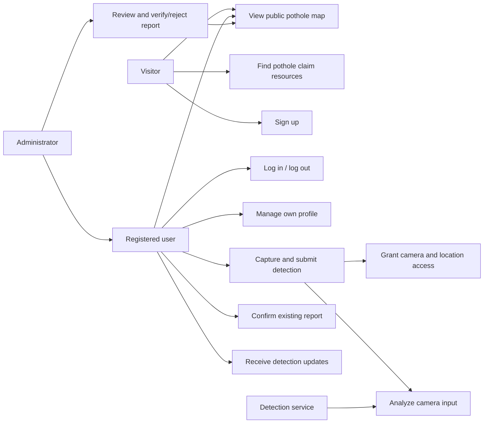
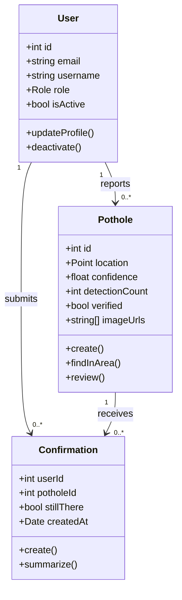
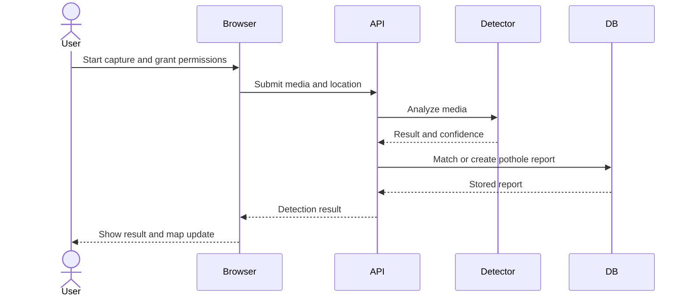
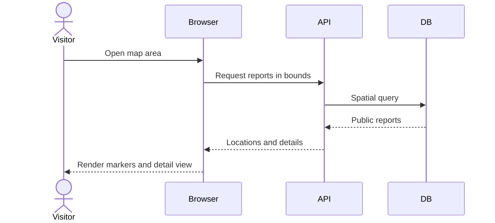
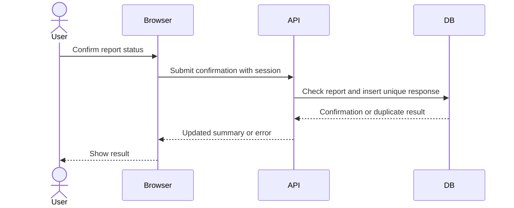
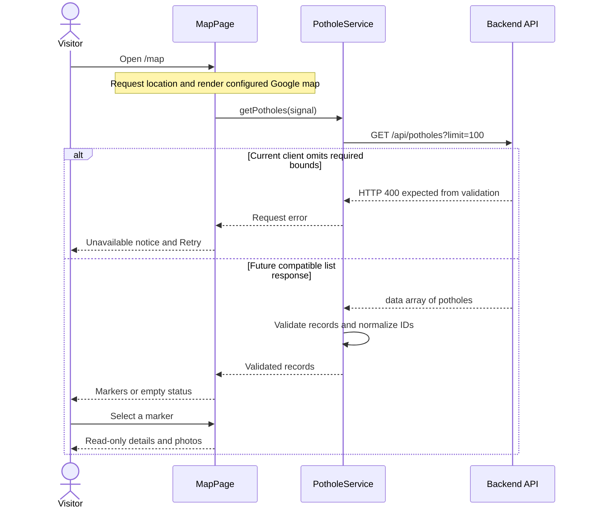

# Software Requirements and Design Report

**Project:** Open Pothole Tracker

**Repository inspected:** 2026-10-05, including the latest pull through `85548cb`. Browser test evidence below predates the newly merged pothole API.

**Project team:** Linh Nguyen, Thien Le, Vinh Do, Hoang Vu, Quang Minh Nguyen

> Requirements and acceptance criteria below are a **draft specification**. “Implemented” means visible in this repository; it does not mean runtime verified.

## 1. Overview and scope

Open Pothole Tracker is intended to let people detect potholes from device camera input, associate detections with GPS coordinates, view reports on a shared interactive map, receive timely updates, confirm whether a pothole remains, and let administrators review reports. Visitors should also be able to find pothole claim resources. The target is a mobile-friendly web application. Increment 1 now includes the React frontend foundation, public claim resources, map/marker/detail components, account/profile APIs, image-analysis integration, and a nearby-pothole query over PostGIS. The web app has been started locally, but the complete detection-to-stored-report-to-map workflow, community confirmations, and administrative review remain incomplete.

**Actors:** visitor (no account), registered user, administrator, and the external detection service/model. Administrators also have registered-user capabilities. “Report” below means a stored pothole record; “detection” means a camera-analysis result that may create or update a report.

## 2. Functional requirements

Each requirement describes a user-visible capability at a high level. The lead and supporting modules identify where the work belongs; several flows require integration across team members. Priorities describe proposed scope, while the last column reports only what is visible in this repository.

| ID | Priority | Functional requirement | Lead module / member | Supporting module(s) | Repository status |
| --- | --- | --- | --- | --- | --- |
| FR-01 | High | Users shall be able to create accounts, sign in and out, and manage their profiles. | Authentication and accounts — Hoang Vu | Backend API — Linh Nguyen | Account/profile APIs and pages are connected to the frontend app; end-to-end account verification is not recorded in this report. |
| FR-02 | High | Visitors and users shall be able to explore an interactive map and view pothole details by location. | Frontend and map — Thien Le | Geospatial — Vinh Do; backend API — Linh Nguyen | Google Maps page, location arrow, markers, read-only detail popups, and image viewer exist. A bounds-based list API now exists, but its parameters and response fields differ from the frontend client. Populated-data integration remains pending. |
| FR-03 | Low | Visitors shall be able to find insurance and transportation-agency resources for pothole claims. | Public frontend — Thien Le | — | Public home page includes transportation-agency and insurance claim links; current destinations and eligibility wording need manual review. |
| FR-04 | High | Users shall be able to capture road footage with their device camera and share their location for detection. | Camera, GPS, and geospatial — Vinh Do | Frontend — Thien Le | Map-only geolocation and a location arrow exist. Camera capture and associating submitted detection frames with GPS remain deferred. |
| FR-05 | High | The system shall analyze submitted camera data for potholes and return detection results. | AI detection — Quang Minh Nguyen | Camera/GPS — Vinh Do; backend API — Linh Nguyen | POST /api/detections/analyze preprocesses JPEG/PNG input and calls a configured Roboflow model; detection persistence and image-upload routes now exist separately; the complete browser capture/inference/persistence flow remains unverified. |
| FR-06 | High | The system shall store and retrieve pothole reports with their location, detection information, and images. | Backend, database, and APIs — Linh Nguyen | AI detection — Quang Minh Nguyen; geospatial — Vinh Do | PostGIS tables and routes for detection persistence, image upload, list/detail/along-route reads, and nearby lookup exist; frontend contract integration and end-to-end verification remain pending. |
| FR-07 | Medium | The system shall support nearby-pothole lookup and handling of duplicate reports. | Geospatial — Vinh Do | Backend/database — Linh Nguyen | Nearby lookup exists; detection creation now matches a pothole within 10 meters or inserts one. Live spatial-query and duplicate-handling tests remain pending. |
| FR-08 | Medium | Users shall receive real-time detection notifications and see newly reported potholes on the map. | Real-time backend — Linh Nguyen | Frontend and map — Thien Le | Read-only map UI exists; real-time transport and notification UI are deferred. |
| FR-09 | High | Users shall be able to confirm whether a pothole is still present and view community feedback. | Crowdsourcing — Hoang Vu | Backend/API — Linh Nguyen; frontend — Thien Le | An authenticated POST /api/potholes/:id/confirmations route now upserts a response and returns a summary; community UI and end-to-end testing remain pending. |
| FR-10 | High | Administrators shall be able to review reports, images, and confirmations in a dashboard and verify, reject, or manage reports. | Administration — Hoang Vu | Backend/API — Linh Nguyen; frontend — Thien Le | Admin role and `verified` field exist; dashboard and review workflow are absent. |
| FR-11 | High | The system shall restrict account, confirmation, and administrative actions according to user identity and role. | Authentication and authorization — Hoang Vu | Backend API — Linh Nguyen | Auth middleware and ownership checks exist; future feature routes still need access controls. |

Detection creation currently uses a 10-meter matching radius. Detection thresholds, validation of this duplicate policy, and report-review policy still need team agreement.

## 3. Non-functional requirements

These are proposed, testable acceptance criteria. Numeric targets are drafts pending team agreement.

| ID | Property | Proposed criterion and verification |
| --- | --- | --- |
| NFR-01 | Security | Serve production traffic over HTTPS; use HttpOnly, Secure session cookies; protect account, report, confirmation, and review writes with the appropriate authentication and ownership/admin checks. Verify with unauthorized and cross-user requests. |
| NFR-02 | Privacy | Request camera access for detection and location access for detection or a location-centered map; explain each purpose and avoid storing raw footage unless the user submits it. Verify permission, denial, and stored-payload behavior. The current map requests location on entry; this does not establish a completed privacy check. |
| NFR-03 | Data integrity | Reject coordinates outside latitude −90..90 and longitude −180..180, confidence outside 0..1, and duplicate confirmations. Verify API validation and database constraints. |
| NFR-04 | Performance | Proposed target: 95% of map-area requests complete within 2 seconds for an agreed test data set and deployment environment. Measure at the API boundary. |
| NFR-05 | Update latency | Proposed target: an accepted report appears on an open map within 10 seconds under a working network connection. Measure end-to-end. |
| NFR-06 | Reliability | A detection-service failure must not create a confirmed pothole or crash the API; users receive a recoverable error. Verify fault injection. |
| NFR-07 | Accessibility | Core account, map, and reporting tasks shall be usable by keyboard and expose text alternatives/status to assistive technology. Verify manual keyboard and screen-reader checks. |
| NFR-08 | Compatibility | Support current desktop and mobile browsers that provide required camera/geolocation APIs; provide a clear fallback when a browser or device lacks them. Verify a documented browser/device matrix. |
| NFR-09 | Visual consistency | Preserve the agreed page layout, typography, colors, marker animations, popup/image presentation, and responsive behavior across increments. Compare rendered screens using the same viewport, theme, map configuration, location, and data. |

Current security building blocks include bcrypt password hashes, Zod validation, JWT verification, and an HttpOnly cookie (`backend/src/controllers/auth.controller.ts`, `backend/src/middleware`). The schema constrains confidence and uniqueness of confirmations. The nearby endpoint validates coordinates, radius, and limit, and the frontend validates returned coordinates and confidence. Detection-write and confirmation routes also have validation schemas; this source inspection does not establish complete authorization, validation-test coverage, or privacy/performance verification. Map markers have keyboard activation and request status is exposed to assistive technology; complete keyboard, focus, screen-reader, and device testing remains pending.

## 4. Use cases

**UC-1, detect and report:** A signed-in user starts detection, grants camera and location access, captures input, and submits it. The service validates the input and coordinates, analyzes it, and returns a result. An accepted pothole is stored or matched to an existing report; the map receives the update. Permission denial, no pothole, invalid data, and analysis failure are separate outcomes.

**UC-2, view map:** A visitor or signed-in user opens `/map` without being required to log in. The frontend requests location access, centers the map on the available location (with a fallback if unavailable), and requests public potholes. Selecting a marker opens read-only location, detection date, confidence, detection count, verification status, and available photos. A failed data request shows an error and Retry; a successful empty response leaves no pothole markers and announces empty status to assistive technology. Increment 1 implements the client UI. The newly merged list API requires west/south/east/north bounds and returns a bare array; the frontend has not yet been connected to that contract. Viewport-based client querying and automatic updates are later integration work.

**UC-3, confirm report:** A signed-in user opens a report, chooses “still there” or “not there,” and submits. The system records one response for that user/report and updates the summary. The current API updates the same user/report response on a repeated submission; the community UI and this behavior still need end-to-end verification.

**UC-4, review report:** An administrator opens pending reports, examines evidence and confirmations, and records a verification or rejection decision. Other users cannot perform the action. Rejected-report visibility and audit history need design decisions.

**UC-5, find claim resources:** A visitor opens `/`, views the public claim-resource cards, and selects a link to open an agency or insurer website in another tab. An account is not required. The application provides links, not claim submission or a guarantee of reimbursement; each provider determines eligibility. The page exists; external link checks are still planned.

**UC-6, manage account:** A user signs up or signs in, views their profile, makes account changes, and signs out. Administrative actions remain available only to administrators.

**UC-7, receive update:** While viewing the map, a user receives a notice of a new detection and sees the associated report appear on the map.

## 5. Design and interaction diagrams

The repository uses TypeScript modules and object-style models rather than a complete class hierarchy. This conceptual domain diagram shows data and intended operations. `deactivate`, `create`, and `summarize` correspond to existing model methods; `updateProfile`, `findInArea`, and `review` are proposed operations.

The three key sequences below show the intended completed system. Image analysis, detection persistence, bounds/nearby reads, and confirmations now have routes, but their complete browser flows are not yet integrated and verified. Section 8 describes the narrower Increment 1 frontend flow.

## 6. Operating environment

The current backend is an Express 5/TypeScript API with a declared **Node.js >=24** requirement (`backend/package.json`). It expects `PORT`, `DATABASE_URL`, and `JWT_SECRET` from the environment; Google login also requires a Firebase service account. `backend/docker-compose.yml` defines PostgreSQL 17 with PostGIS 3.5 and mounts `backend/db/schema.sql` for initialization. The intended client is a browser on desktop/mobile hardware with a camera and location capability for detection. The client now has a React 19/TypeScript application, Vite 7 build/development setup, Tailwind CSS 4 styles, and routes for `/`, `/map`, `/login`, `/signup`, and `/profile`. Google Maps is integrated through `@vis.gl/react-google-maps` and needs `VITE_GOOGLE_MAPS_API_KEY` and `VITE_GOOGLE_MAPS_ID`. The frontend build was verified using Node 24.12.0. With `VITE_API_URL` blank, the Vite development proxy forwards `/api` requests to `http://localhost:8000`; deployment requires equivalent API routing or an appropriately configured API origin.

## 7. Assumptions and dependencies

- Camera and geolocation permissions, GPS accuracy, network connectivity, and browser support affect detection quality and availability.
- Google Maps is the frontend map provider. The backend image-analysis adapter uses Roboflow and requires `ROBOFLOW_API_KEY`, `ROBOFLOW_PROJECT_ID`, and `ROBOFLOW_MODEL_VERSION`. Their presence in source does not establish successful live service testing.
- The frontend currently expects `GET /api/potholes?limit=100` to return `{ data: Pothole[] }`. The backend now provides `/api/potholes` requiring west/south/east/north bounds and returning a bare array with `id`, `lat`, `lng`, `confidence`, `detection_count`, `verified`, `created_at`, and `last_detected_at`. The detail endpoint additionally returns `image_urls`. The separate coordinate-based nearby endpoint also returns a bare array. These contracts must be aligned before claiming frontend/backend map integration.
- Firebase is required only for the Google login path; email/password login uses the local database.
- The database architecture in this repository uses PostgreSQL/PostGIS. Future design and deployment instructions should use the actual schema unless the team decides to migrate.
- A fresh database must load the SQL schema; the mounted init script will not automatically migrate an existing database volume.
- The team must decide how to handle inaccurate GPS readings, duplicate detections, stale reports, image retention, and moderation history.

## Repository status summary

| Area | Observed state |
| --- | --- |
| Accounts | Auth/profile routes and models exist; their pages are connected to the frontend shell. |
| Spatial data | PostGIS schema, `PotholeModel.create`, and nearby lookup exist; live-database verification is pending. |
| Community input | Confirmation model and authenticated upsert route exist; community UI remains pending. |
| Detection | Image analysis, detection persistence with 10-meter matching, and image upload exist; complete browser capture/inference/persistence integration remains pending. |
| Map/public pages | Frontend map, markers, details, image viewer, and claim resources exist; the new list API still needs request and response adaptation in the frontend. |
| Administration | Roles exist; review dashboard/workflow are not implemented. |
| Delivery | Backend manifest/Compose and frontend manifest/build setup exist. Frontend build/type checks passed; nearby HTTP/query-argument tests are recorded in the team progress log. Full browser/API validation remains pending. |

## 8. Increment 1 frontend design

**Runtime evidence update (2026-10-05):** Thien reported the basic page/map checks working and a successful API/database health response. Before the latest API pull, browser-console evidence showed frontend requests reaching the API: `/api/auth/me` returns 401 while logged out, and `/api/potholes?limit=100` returns 404. FR-02 is therefore only partially verified. The latest source now includes a list handler; real pothole markers/details still require frontend contract adaptation and a new test. These checks do not establish successful nearby spatial queries, full authentication, exact visual parity, or a complete browser/device matrix.

**Owner:** Thien Le (`cl23m`). **Implementation evidence:** [PR #5](https://github.com/QuangMinhNguyen27405/CEN4090L-open-pothole-tracker/pull/5), commit [`7703114`](https://github.com/QuangMinhNguyen27405/CEN4090L-open-pothole-tracker/commit/7703114). Primary requirements are FR-02 and FR-03; the application shell also integrates the existing FR-01 pages.

| Component | Responsibility |
| --- | --- |
| `App.tsx`, `appLayout.tsx`, `navbar.tsx` | Define routes and the shared navigation/provider layout. |
| `context/theme.tsx` and shared UI/styles | Apply light/dark themes and consistent desktop/mobile presentation. |
| `homePage.tsx` | Display public transportation-agency and insurer resource cards. |
| `mapPage.tsx`, `authHook.ts`, `compassMarker.tsx` | Request browser location/orientation, render Google Maps and the location arrow, and manage the pothole request/status. |
| `services/potholeService.ts` | Fetch the list with a 15-second timeout and cancellation, validate its shape using Zod, and normalize numeric/string IDs to strings. |
| `potholeMarker.tsx`, `imageViewer.tsx` | Display animated markers, anchored read-only details, image thumbnails, and full-screen photo viewing. |

The list contract includes `_id`, `latitude`, `longitude`, `confidenceScore`, `detectedAt`, `verified`, `detectionCount`, and `images`. The frontend expects a `{ data: [...] }` envelope, latitude in -90..90, longitude in -180..180, confidence in 0..1, and an array of image URLs. The current marker uses the frontend list record for all details. The new backend list response omits images, while its detail route supplies `image_urls`; integration must decide how to populate photos without changing the agreed presentation. Verification/confidence colors describe report status and detection confidence, not pothole severity. Invalid responses follow the error path rather than appearing to be an empty map.

The latest base list API requires bounds, and the separate nearby API added in PR #6 requires latitude/longitude and accepts bounded radius/limit parameters. Integrating it will require an agreed request/response contract and testing; it is not automatically consumed by the existing list client. Camera capture, driving/directions, live notifications, and community/admin controls are outside this frontend increment. Preserve the agreed visual design when those features are added.
